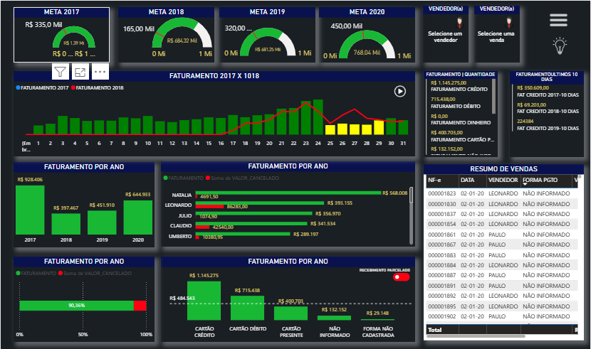

# 📊 Dashboard de Faturamento e Vendas

Este projeto consiste em um **dashboard interativo desenvolvido no Power BI**, com foco no acompanhamento de **metas, faturamento, vendas e cancelamentos** ao longo dos anos.  
O objetivo é fornecer uma visão clara e prática do desempenho financeiro da empresa, ajudando na **tomada de decisão estratégica**.

---

## 🚀 Funcionalidades

- **Metas anuais (2017 a 2020)** com indicadores de progresso.
- **Faturamento diário e mensal** com comparativo entre anos.
- **Análise por vendedor** (faturamento, vendas e cancelamentos).
- **Resumo de vendas** detalhado, incluindo data, vendedor e forma de pagamento.
- **Distribuição por forma de pagamento** (débito, crédito, dinheiro, parcelado, etc.).
- **Indicadores de cancelamento** com impacto no faturamento.
- **Filtros interativos** para explorar diferentes perspectivas.

---

## 📈 Principais Insights

- Evolução do **faturamento anual** entre 2017 e 2020.  
- Identificação dos **vendedores com melhor desempenho**.  
- Comparação entre **vendas realizadas e canceladas**.  
- Distribuição das vendas por **formas de pagamento**.  
- Análise de **tendência diária** de faturamento.  

---

## 🛠️ Tecnologias Utilizadas

- **Power BI** – Criação e modelagem dos dashboards.  
- **SQL Server** – Base de dados para consolidação das informações.  
- **Excel** – Apoio na organização e tratamento de dados.  

---

## 📷 Demonstração

> O dashboard é totalmente interativo, permitindo análises rápidas e comparativos entre períodos.

---

## 📌 Como Utilizar

1. Baixe o arquivo `.pbix` (caso disponível).  
2. Abra no **Power BI Desktop**.  
3. Conecte à sua base de dados ou utilize os dados já carregados.  
4. Explore os filtros e interações do dashboard.  

---

## 👨‍💻 Autor

**Thiago Vinícius**  
📧 [thiagovfb.developer@gmail.com](mailto:thiagovfb.developer@gmail.com)  
📱 +55 (81) 9 8366-9631  

---

## 📜 Licença

Este projeto é de uso demonstrativo.  
Sinta-se à vontade para utilizá-lo como inspiração em seus próprios dashboards.
